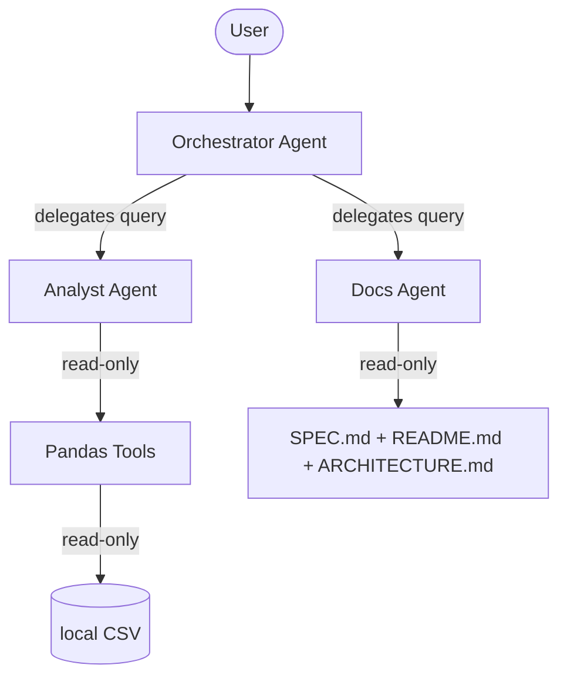

# Architecture

## Diagram

## Decisions

### 1. Sub-agents vs. Single Agent
* **Choice**: We chose a multi-agent system consisting of an Orchestrator routing to Analyst and Docs sub-agents.
* **Alternative**: A single agent equipped with all analytical tools and documentation loaded into context.
* **Rationale**: Multi-agent partitioning prevents the context length of project documentation from polluting the Analyst's focus, resulting in more accurate tool parameters. It also scales better if new domain specialists are added later.

### 2. Routing via Orchestrator Instructions vs. Code
* **Choice**: Routing is handled dynamically by LLM reasoning under Orchestrator instructions.
* **Alternative**: Hardcoding a keyword router or classifier in Python code to distribute tasks.
* **Rationale**: LLM-based delegation naturally accommodates conversational nuances and greetings. It allows the Orchestrator to welcome users and introduce the system rather than executing rigid matching.

### 3. Enforcing Security in Tool Functions vs. Agent Instructions
* **Choice**: Security rules (whitelist, row caps, read-only paths) are enforced programmatically inside python tool functions.
* **Alternative**: Instructing the Analyst agent via system prompts to respect columns and row counts.
* **Rationale**: LLM instructions are suggestions that can be bypassed by jailbreaks or hallucinations, whereas code constraints are strict programmatic guarantees. Executing validation before calling Pandas secures the application engine.

### 4. Loading SPEC.md into Context vs. Vector Store
* **Choice**: Reading SPEC.md and other files directly into the Docs agent's system prompt context.
* **Alternative**: Setting up a local vector database and utilizing retrieval-augmented generation (RAG).
* **Rationale**: Given the tiny size of the project specifications, direct context injection is faster, less complex, and guarantees 100% retrieval accuracy. A vector store adds unnecessary infrastructure overhead.

### 5. Three Narrow Tools vs. One General Pandas Execution Tool
* **Choice**: Three distinct tools (`summary_stats`, `top_values`, and `find_outliers`).
* **Alternative**: A general run_pandas tool executing dynamic Python queries.
* **Rationale**: Dynamic python execution creates a dangerous sandbox breakout vector. Providing specific, narrowly bounded functions makes validation straightforward and keeps the tool inputs highly structured.
