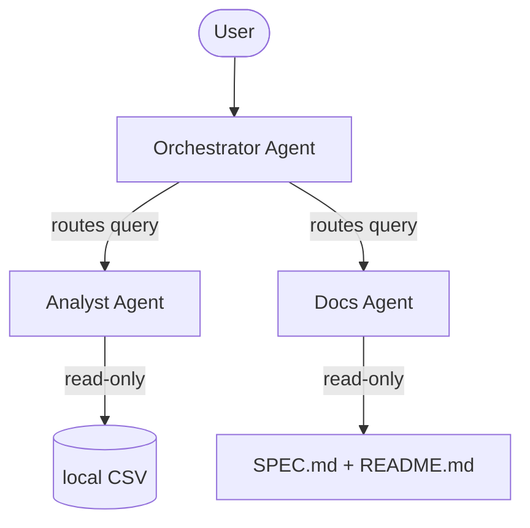

# Dataset Docent

"A museum docent for your data project. Ask it anything instead of reading the wiki."

Dataset Docent is a minimal multi-agent system built using Google's Agent Development Kit (ADK). It onboard new analysts or reviewers to a data project. It answers data questions using local pandas tools and documentation questions using the project specification.

## Architecture



- **Orchestrator**: Evaluates user queries and routes them to the Analyst or Docs agent.
- **Analyst**: Possesses read-only tools executing pandas operations on a synthetic data sample modeled on CMS Open Payments.
- **Docs**: Reads the committed SPEC.md, README.md, and ARCHITECTURE.md into context to explain the project.

## Security Features

1. **Read-Only Data Access**: Tools utilize `pandas.read_csv` in a strictly read-only fashion. No file write or delete actions are possible.
2. **Column Whitelisting**: Analyst tools validate column names against a whitelist (`ALLOWED_COLUMNS`) before running pandas commands. Unapproved columns return a generic safety rejection message.
3. **Row Limits**: Results are capped at 20 rows using Python limits (`min(n, 20)`) to prevent large memory overheads or data extraction.
4. **Credential Isolation**: Gemini API key is loaded strictly from the `GOOGLE_API_KEY` environment variable. It never enters code files.

## Project Structure
- `SPEC.md`: The product specifications and requirements.
- `ARCHITECTURE.md`: Flowchart and detailed explanations of design choices.
- `README.md`: This file.
- `requirements.txt`: Python package dependencies.
- `app/agent.py`: Agent configurations.
- `app/tools.py`: Analytic pandas operations.
- `app/open_payments_sample.csv`: Synthetic data sample modeled on CMS Open Payments.

## Setup & Running

1. **Setup Environment**:
   Ensure you have `uv` installed, then install dependencies:
   ```bash
   uv pip install -r requirements.txt
   ```

2. **Run locally via ADK Web UI**:
   Set your Google API Key and start the playground:
   ```bash
   export GOOGLE_API_KEY="your_gemini_api_key_here"
   export GOOGLE_GENAI_USE_VERTEXAI=False
   agents-cli playground
   ```

3. **Verify with queries**:
   - "What does this project do?" (Routed to Docs)
   - "What is the average payment size?" (Routed to Analyst -> summary_stats)
   - "Which payments are outliers?" (Routed to Analyst -> find_outliers)

## 5-Minute Video Outline

- **0:00 - 1:00: Hook & The Problem** (Introducing Dataset Docent, showing the tagline, explaining the onboard friction of a new analyst).
- **1:00 - 2:00: Architecture Walkthrough** (Walk through the Orchestrator, Analyst, and Docs agents using the Mermaid diagram).
- **2:00 - 3:00: Security Rules Demo** (Highlight the read-only, whitelisting, and row capping implementation in `app/tools.py`).
- **3:00 - 4:30: Live Playthrough** (Ask "What does this project do?", "What are the average payments?", and query for anomalies, showcasing routing in action).
- **4:30 - 5:00: Wrap Up** (Summary of ADK capabilities, future portfolio plans like adding BigQuery).
