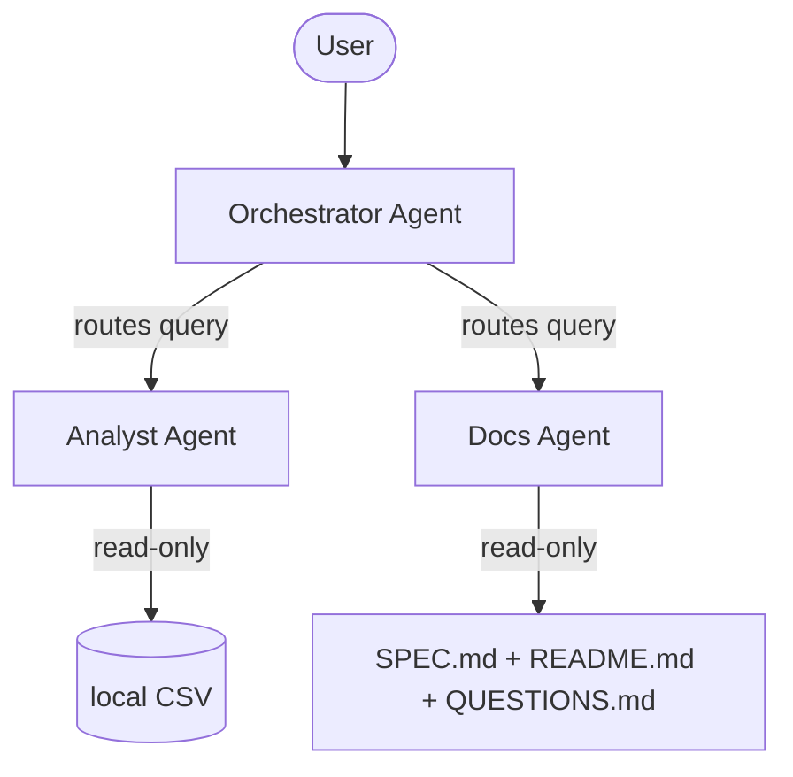

# Dataset Docent

"A living docent for your data project. Ask it anything instead of reading a static wiki."

Dataset Docent is a compliance analytics tool designed for exploratory data analysis (EDA) and Z-score outlier detection on CMS Open Payments healthcare compliance data. Rather than acting as a static museum piece, this docent represents a living project: it dynamically reads the current specification, architecture document, and dataset at query time. As your project and data change, the tour changes with it.

Through its agent layer, the docent can also explain and justify its own design decisions.

## Architecture



- **Orchestrator**: Evaluates user queries and routes them to the Analyst or Docs agent.
- **Analyst**: Possesses read-only tools executing pandas operations on a synthetic data sample modeled on CMS Open Payments.
- **Docs**: Reads the committed SPEC.md, README.md, ARCHITECTURE.md, and QUESTIONS.md into context to explain the project and its design choices.

## Security Features

1. **Read-Only Data Access**: Tools utilize `pandas.read_csv` in a strictly read-only fashion. No file write or delete actions are possible.
2. **Column Whitelisting**: Analyst tools validate column names against a whitelist (`ALLOWED_COLUMNS`) before running pandas commands. Unapproved columns return a generic safety rejection message.
3. **Row Limits**: Results are capped at 20 rows using Python limits (`min(n, 20)`) to prevent large memory overheads or data extraction.
4. **Credential Isolation**: Gemini API key is loaded strictly from the `GOOGLE_API_KEY` environment variable. It never enters code files.

## Project Structure
- `SPEC.md`: The product specifications and requirements.
- `ARCHITECTURE.md`: Flowchart and detailed explanations of design choices.
- `QUESTIONS.md`: Answers to key technical design questions for reviewers.
- `README.md`: This file.
- `requirements.txt`: Python package dependencies.
- `dataset_docent/agent.py`: Agent configurations.
- `dataset_docent/tools.py`: Analytic pandas operations.
- `dataset_docent/open_payments_sample.csv`: Synthetic data sample modeled on CMS Open Payments.

## Setup and Running

1. **Setup Environment**:
   Ensure you have `uv` installed, then install dependencies:
   ```bash
   agents-cli install
   ```

2. **Run locally via ADK Web UI**:
   Set your Google API Key and start the playground:
   ```bash
   export GOOGLE_API_KEY="your_gemini_api_key_here"
   export GOOGLE_GENAI_USE_VERTEXAI=False
   agents-cli playground
   ```

3. **Verify with queries**:
   - "What does this project do?" (Routed to Docs)
   - "What is the average payment size?" (Routed to Analyst -> summary_stats)
   - "Which payments are outliers?" (Routed to Analyst -> find_outliers)

## Reviewer Questions (Loaded by Docs Agent)
The Docs agent loads and can answer these specific design questions from `QUESTIONS.md`:
1. Why sub-agents instead of one agent?
2. Why enforce security in tool code rather than agent instructions?
3. Why load docs into context instead of a vector store?
4. Why three narrow tools instead of one general run_pandas tool?
5. Why Mermaid for the diagram?
6. What statistical method detects outliers and why?

## 5-Minute Video Outline

- **0:00 - 1:00: Hook & The Problem** (Introducing Dataset Docent, explaining the onboarding friction of a new analyst on a rapidly changing codebase).
- **1:00 - 2:00: Architecture Walkthrough** (Walk through the Orchestrator, Analyst, and Docs agents using the Mermaid diagram).
- **2:00 - 3:00: Security Rules Demo** (Highlight the read-only, whitelisting, and row capping implementation in `dataset_docent/tools.py`).
- **3:00 - 4:30: Live Playthrough** (Ask "What does this project do?", "What are the average payments?", and query for anomalies, showcasing routing in action).
- **4:30 - 5:00: Wrap Up** (Summary of ADK capabilities, future portfolio plans like adding BigQuery).
